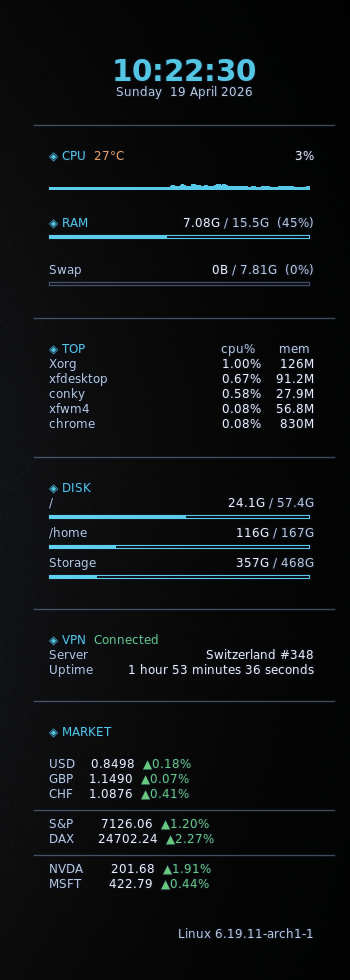
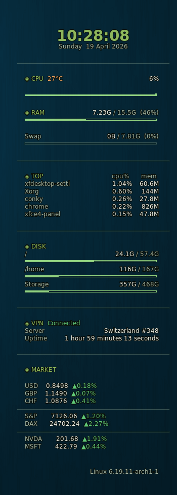
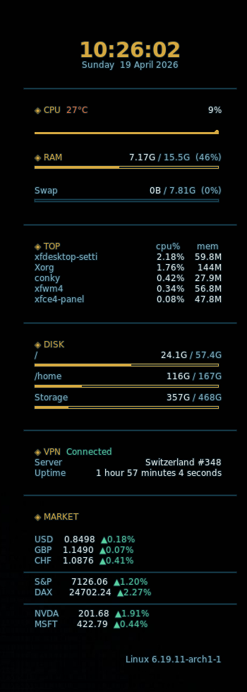
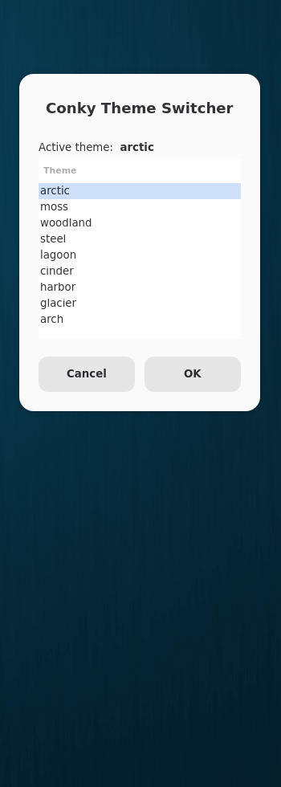

# conky-themes

A simple, modular Conky layout with an external theme system.

> Theme switcher uses `zenity` which should be fine for any Linux distro.

---

## Screenshots

| arctic | moss | lagoon | switcher GUI |
|--------|------|--------|--------------|
|  |  |  |  |

---

## Core idea

I got tired of manually tweaking colours every time I changed my wallpaper. Most configs hardcode everything — this one moves all colour, shadow and outline settings into a separate `themes/themes.lua` file. Switching themes is a one-word change in the config, or a single click in the GUI.

The config is split into section modules loaded via `dofile()`. The niche ones — NordVPN status and the finance/market overlay — live in `modules/` and are easy to drop: remove the `dofile()` line and the corresponding `%s` placeholder in `conky.text`.

---

## Themes

Themes live in `themes/themes.lua`. Each entry controls colours, shadow depth and outline independently:

```lua
mytheme = {
  -- Description
  default_color         = 'C0C8D8',
  default_shade_color   = '040810',
  draw_shades           = true,
  shade_depth           = 3,          -- dramatic themes warrant more depth
  default_outline_color = '0A0E18',
  draw_outline          = true,
  outline_depth         = 1,
  color1 = 'ECEEF4',  -- bright  · values
  color2 = 'B8C8DC',  -- mid     · labels
  color3 = '404858',  -- dim     · dividers / bars
  color4 = '54C6E4',  -- accent  · section headers  ★
  color5 = 'ECA060',  -- heat    · temperature
  color6 = '68C880',  -- ok      · connected / positive
  graph_lo = '1A2535', graph_hi = '54C6E4',
},
```

### Generating new themes (lazy approach)

AI engines are generally good at generating colour themes. Sample dominant background colours with a colour picker, supply them to the prompt — something like *"propose a conky theme with accent colour for a background like #294d6d"*.

---

## Installation

```bash
git clone https://github.com/edvinassvedas-dev/conky-themes ~/.config/conky
chmod +x ~/.config/conky/themes/theme-switch.sh
conky -c ~/.config/conky/conky.conf &
```

---

## Theme switcher

`theme-switch.sh` uses `zenity` to list all themes defined in `themes/themes.lua`, applies the selection with `sed` and restarts Conky.

```bash
bash ~/.config/conky/themes/theme-switch.sh
```

This can be added to a launcher in your DE of choice, or used for a keyboard shortcut.

### Switching manually

Edit the tagged line in `conky.conf` directly:

```lua
local t = themes.arctic   -- ← theme-switch.sh rewrites this line
```

---

## Finance module

`modules/finance.py` fetches FX rates and index prices from Yahoo Finance via `yfinance` — no API key required. Make it executable first:

```bash
chmod +x ~/.config/conky/modules/finance.py
```

Configure the watchlist at the top of the file. Types: `"fx"` (4 decimal places), `"stock"` (2 decimal places), `"sep"` (hairline divider). Daily change is colour-coded using `color6` / `color5`. Poll interval is set in `modules/finance.lua`.

---

## Dependencies

| Package | Required for |
|---------|--------------|
| `zenity` | theme switcher GUI |
| `ttf-jetbrains-mono` | font |
| `python-yfinance` | finance module only |
| `nordvpn` | VPN module only |

---

## Licence

MIT — do whatever you like.
